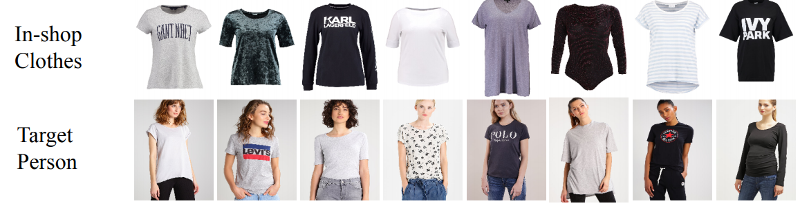
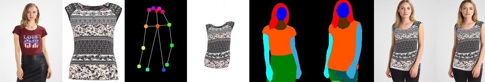

<p align="center"><strong>  </strong></p>


# Introduction : ShopSquad - Turn ON your SHOP mode with your FAM
ShopSquad is an all-in-one platform for a seamless online shopping experience. We aim to provide the experience of shopping with friends without actually being with them and at the same time user can virtually try on a product before buying it. 

ShopSquad can be the next big hit in the online retail industry just like Netflix Watch Party has been a huge success in the entertainment industry  in pandemic.

# Demo Video Link

# Presentation Link


# Table of contents

- [Motivation](#motivation)
- [Existing Solutions](#existing-solutions)
- [Our Solution](#our-solution)
- [Snapshots](#snapshots)
- [Features](#features)
- [Installation](#installation)
- [Tech Stack](#tech-stack)
- [Benefits](#benefits)
- [Team Members](#team-members)


# Motivation

There are 2 major problems that we see in the present online shopping experience which we intend to solve through this project :

- **Until now, online shopping has been lonely.** It’s brought the benefits of accessing a wide variety of products with the convenience of being shipped to your door -- but it’s stripped out all human connection. A McKinsey report said more than half of consumers want stores to follow safety guidelines for the sake of both shoppers and workers, and 59% said it’s important that stores aren’t crowded.  “People tend to have a higher probability to buy when with another person or a group because a friend affirms decisions that one might not make when shopping alone, so the shopper has a reduced risk perception of the purchase which makes the activity more careless,” says Max H. Brüggemann, director of customer engagement at Capgemini Invent.

- There are numerous fundamental challenges with online buying that businesses must overcome to remain competitive in today's market. Virtual try-on technology lets customers see how clothes fit themselves or an avatar, allowing them to virtually “try on” clothing before purchasing them. **In real life, fitting rooms are the heart of the shopping experience. Changing clothes and accessories creates a level of intimacy between a brand and consumer.**

# Existing Solutions

- There is no convenient platform to enable users to experience shopping with their loved ones. There are Shop Party which lets users to come online and shop together while streaming what they are seing. For this Users have to be online at the same time.
- A third party like whatsApp is often used to share items and get opinions from friends. Our bussiness should not rely on a third party.
- Right now users either have more than one accounts, one for personal use and one for sharing. This brings a lot of security issues and redundant work. ShopSquad solves this by allowing them to make groups within the application. 
- There is always a doubt on whether an item will look as good as it looks on the site.  There are only a few website that provide virtual try on facility.

# Our Solution

With ShopSquad, we’re bringing you all three. Our users can go shopping with their friends and hang out at the same time. You can play games together and use the prizes to get discounts on group order.
ShopSquad is a social shopping platform where you can find more than 1,000 vetted brands across women’s and men’s clothing and accessories, makeup, skin care, home decor and more.You can shop together while doing it safely. That’s great during COVID-19 and great after COVID-19.

The shared shopping experience provides more credibility for a product and word of mouth has always been a strong driver for purchase.

Broadly speaking, the end goal of our project here was to implement a virtual try-on network — essentially taking in-shop clothing and a person image as input to give output as an image of a person wearing those clothes and providing an in-built social chat application to enable users shop along with their family & friends with the comfort of being at home (social distancing in these dare times). The model implemented has been done with a focus on tops, with complete apparel transfer being potential future work.





Model Used: [**Down to the last Detail Virtual-Try-On**](https://github.com/JDAI-CV/Down-to-the-Last-Detail-Virtual-Try-on-with-Detail-Carving)<br />


Working:<br />


<br />


**STEP 1**: Model Image is processed using OpenPose to mark keypoints<br />
**STEP 2**: Using the keypoints, the image is segmented into various features: face, arms, body etc.<br />
**STEP 3**: The cloth mask of the clothing item is generated.<br />
**STEP 4**: The mask and the segmented image are warped together.<br />


# Snapshots


# Features 
- **Current Key Features:**
   - User can Login/Sign Up 
   - Email verification for first time users
   - User can also order without creating an account and logging in (Guest checkout feature)
   - Payment feature through Paypal API
   - User can add multiple number of items of a same product
   - Order summary is visible after payment confirmation
   - Logged in user can have multiple shipping addresses
   - Logged in user can see how a particular dress looks on them
   - User can make groups and add family & friends 
   - Groups have a shared cart and each member can add items to that cart
   - Each member can add an item with their destination address
   - Anyone from a group can do the payment and it will be notified to all others
 - **Future Scope:**
   - Users can like and follow each other to see what others are up to
   - Expanding Virtual Try On to full apparel including jewelry, lenses etc.,
   - Using AR/VR to showcase how a product looks in real surrounding
   - Discounts based on the number of members ordering an item in a group.
   - Recommending items in the group based on the group interests
   - Building an E-Commerce Metaverse


# Installation
Clone this Repository on your local machine by running the following command on your terminal - 
```git clone "https://github.com/hackko-20/Virtual-Try-On.git"``` 
OR download the zip folder.

Install Anaconda3 on your PC, and add it to your path. Follow the steps below in your terminal:<br />
```cd "Path where you have cloned this repository"```<br /><br />
Create a virtual environment in conda<br />
```conda create -n tryon```<br /><br />
```conda activate tryon```<br /><br />
```pip install -r requirement.txt```<br /><br />
To run server, run the following command:
```python manage.py runserver```<br /><br />

For the model, clone [**Repository**](https://github.com/JDAI-CV/Down-to-the-Last-Detail-Virtual-Try-on-with-Detail-Carving).
In Virtual-Try-On/store/views.py under the function "virtualTryOn" :

(line 130) Change the path to the current path of Down-to-the-Last-Detail-Virtual-Try-on-with-Detail-Carving\demo\demo.txt on your computer.

(line 141) Change the path given in subprocess to the current path of Down-to-the-Last-Detail-Virtual-Try-on-with-Detail-Carving/demo.sh on your computer.

In Down-to-the-Last-Detail-Virtual-Try-on-with-Detail-Carving/demo.sh:

(line 4) Change the path to the current path of Down-to-the-Last-Detail-Virtual-Try-on-with-Detail-Carving on your computer.

(line 5) Change --forward_save_path value to the current path of Virtual-Try-On/static/images/Viton on your computer.


# Technology Stack
 - **Website Frontend:** HTML, CSS, BootStrap, JavaScript
 - **Website Backend:** Python Django Framework, Paypal API for payment, Web Socket (Django Channels)
 - **Model Backend:** Python, MATLAB, Ananconda3, Libraries (Pytorch, Scikit-Image, OpenCV).

# Benefits
With more and more customers preferring to shop from retailers offering virtual reality eCommerce stores, the popularity of VR-enabled eCommerce platforms is increasing by leaps and bounds across the globe. And with the ongoing worldwide pandemic, it has become the need of the hour.

We have used these emerging technologies in our project that can take customer experience to a whole new level by:
 - Facilitating tech-enabled shopping
 - Helping virtual retailers transcend geographic barriers
 - Allowing customers to try on and assess clothes virtually so that they can decide how a dress looks on them
 - Keeping customers engaged
 - Educating customers about your products
 - Saving customers’ time.
 - Allowing customers to have realtime feedback of how a dress looks on them from family and friends

It would also help the retailers by:
 - Enhancing customer satisfaction
 - Reducing the number of returns
 - Increasing online retail sales and 

 
# Contributors
 Team Name : now_XOR_never
 - [Shreya Yadav](https://github.com/hackko-20)
 - [Khushi Agarwal](https://github.com/khushi-web)
 - [Aparna Mittal](https://github.com/apmit2704)
 - [Anchal Yadav](https://github.com/anchal20198071)


