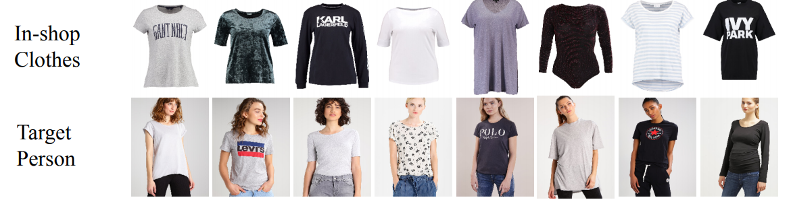
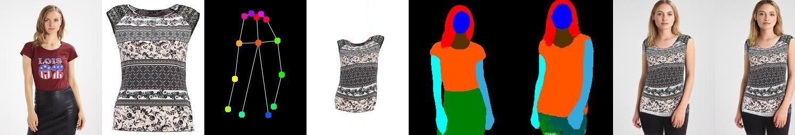

<p align="center"><strong> HackOn with AMAZON </strong></p>

<p align="center">
 
</p>  

# A Collaborative Virtual Try-On E-commerce website
<!-- Add buttons here -->

<!-- Describe your project in brief -->

<!-- The project title should be self explanotory and try not to make it a mouthful. (Although exceptions exist- **awesome-readme-writing-guide-for-open-source-projects** - would have been a cool name)

Add a cover/banner image for your README. **Why?** Because it easily **grabs people's attention** and it **looks cool**(*duh!obviously!*).

The best dimensions for the banner is **1280x650px**. You could also use this for social preview of your repo.

I personally use [**Canva**](https://www.canva.com/) for creating the banner images. All the basic stuff is **free**(*you won't need the pro version in most cases*).

There are endless badges that you could use in your projects. And they do depend on the project. Some of the ones that I commonly use in every projects are given below. 

I use [**Shields IO**](https://shields.io/) for making badges. It is a simple and easy to use tool that you can use for almost all your badge cravings. -->

<!-- Some badges that you could use -->

<!-- 
: This badge shows the version of the current release.


: I think it is self-explanatory. This gives people an idea about how the project is being maintained.


: This is a dynamic badge from [**Shields IO**](https://shields.io/) that tracks issues in your project and gets updated automatically. It gives the user an idea about the issues and they can just click the badge to view the issues.


: This is also a dynamic badge that tracks pull requests. This notifies the maintainers of the project when a new pull request comes.

: If you are not like me and your project gets a lot of downloads(*I envy you*) then you should have a badge that shows the number of downloads! This lets others know how **Awesome** your project is and is worth contributing to.


: This shows what kind of open-source license your project uses. This is good idea as it lets people know how they can use your project for themselves.

: This is not essential but it is a cool way to let others know about your project! Clicking this button automatically opens twitter and writes a tweet about your project and link to it. All the user has to do is to click tweet. Isn't that neat? -->


<!-- Add a demo for your project -->

<!-- After you have written about your project, it is a good idea to have a demo/preview(**video/gif/screenshots** are good options) of your project so that people can know what to expect in your project. You could also add the demo in the previous section with the product description.

Here is a random GIF as a placeholder.

 -->

# Table of contents

<!-- After you have introduced your project, it is a good idea to add a **Table of contents** or **TOC** as **cool** people say it. This would make it easier for people to navigate through your README and find exactly what they are looking for.

Here is a sample TOC(*wow! such cool!*) that is actually the TOC for this README. -->
- [Motivation](#motivation)
- [Solution](#solution)
- [Snapshots](#snapshots)
- [Features](#features)
- [Installation](#installation)
- [Tech Stack](#tech-stack)
- [Benefits](#benefits)
- [Team Members](#team-members)
<!-- - [Resources](#resources) -->

# Motivation
Ecommerce has been able to rake in the kind of popularity that it’s experiencing today all because of the fact that it without fail delivers an engaging shopping experience in the comfort of our homes our workplaces, you name it! In the times of ongoing worldwide pandemic, when isolation is the key to not spread the virus, we wanted to enable customers to get as close as possible to the experience of shopping in a store while they are very much in their own comfort zones. 
As shoppers and most of us living by ourselves, we’re all guilty of indulging big time when taking impulsive decisions while shopping on our own. That’s where the advice of family and friends is much needed. It is definitely one most loved experience we’re missing out on while shopping online.

# Solution
The concept of Collaborative Shopping with AR tends to bridge that very gap.

Broadly speaking, the end goal of our project here was to implement a virtual try-on network — essentially taking in-shop clothing and a person image as input to give output as an image of a person wearing those clothes and providing an in-built social chat application to enable users shop along with their family & friends with the comfort of being at home (social distancing in these dare times). The model implemented has been done with a focus on tops, with complete apparel transfer being potential future work.




Model Used: [**Down to the last Detail Virtual-Try-On**](https://github.com/JDAI-CV/Down-to-the-Last-Detail-Virtual-Try-on-with-Detail-Carving)<br />


Working:<br />


<br />


**STEP 1**: Model Image is processed using OpenPose to mark keypoints<br />
**STEP 2**: Using the keypoints, the image is segmented into various features: face, arms, body etc.<br />
**STEP 3**: The cloth mask of the clothing item is generated.<br />
**STEP 4**: The mask and the segmented image are warped together.<br />


# Snapshots


# Features
 - **Current Key Features:**
   - User can Login/Sign Up 
   - Email verification for first time users
   - User can also order without creating an account and logging in (Guest checkout feature)
   - Payment feature through Paypal API
   - User can add multiple number of items of a same product
   - Order summary is visible after payment confirmation
   - Logged in user can have multiple shipping addresses
   - Logged in user can see how a particular dress looks on them
   - User can make groups and add family & friends 
   - Groups have a shared cart and each member can add items to that cart
 - **Future Scope:**
   - Groups will have a chat feature where the members can talk and take each others feedback on every product
   - Providing a real 3-D environment for an immersive and fun shopping experience
   - Allowing customers to try on and assess different products virtually so that they can decide how a dress, necklace, or lipstick shade would look on them, or if a         piece of furniture would look good in their bedroom.

# Installation
Clone this Repository on your local machine by running the following command on your terminal - 
```git clone "https://github.com/hackko-20/Virtual-Try-On.git"``` 
OR download the zip folder.

Install Anaconda3 on your PC, and add it to your path. Follow the steps below in your terminal:<br />
```cd "Path where you have cloned this repository"```<br /><br />
Create a virtual environment in conda<br />
```conda create -n tryon```<br /><br />
```conda activate tryon```<br /><br />
```pip install -r requirement.txt```<br /><br />
To run server, run the following command:
```python manage.py runserver```<br /><br />

For the model, clone [**Repository**](https://github.com/JDAI-CV/Down-to-the-Last-Detail-Virtual-Try-on-with-Detail-Carving).
In Virtual-Try-On/store/views.py under the function "virtualTryOn" :

(line 130) Change the path to the current path of Down-to-the-Last-Detail-Virtual-Try-on-with-Detail-Carving\demo\demo.txt on your computer.

(line 141) Change the path given in subprocess to the current path of Down-to-the-Last-Detail-Virtual-Try-on-with-Detail-Carving/demo.sh on your computer.

In Down-to-the-Last-Detail-Virtual-Try-on-with-Detail-Carving/demo.sh:

(line 4) Change the path to the current path of Down-to-the-Last-Detail-Virtual-Try-on-with-Detail-Carving on your computer.

(line 5) Change --forward_save_path value to the current path of Virtual-Try-On/static/images/Viton on your computer.


# Tech Stack
 - **Website Frontend:** HTML, CSS, BootStrap, JavaScript
 - **Website Backend:** Python Django Framework, Paypal API for payment, Web Socket (Django Channels)
 - **Model Backend:** Python, MATLAB, Ananconda3, Libraries (Pytorch, Scikit-Image, OpenCV).

# Benefits
With more and more customers preferring to shop from retailers offering virtual reality eCommerce stores, the popularity of VR-enabled eCommerce platforms is increasing by leaps and bounds across the globe. And with the ongoing worldwide pandemic, it has become the need of the hour.

We have used these emerging technologies in our project that can take customer experience to a whole new level by:
 - Facilitating tech-enabled shopping
 - Helping virtual retailers transcend geographic barriers
 - Allowing customers to try on and assess clothes virtually so that they can decide how a dress looks on them
 - Keeping customers engaged
 - Educating customers about your products
 - Saving customers’ time.
 - Allowing customers to have realtime feedback of how a dress looks on them from family and friends

It would also help the retailers by:
 - Enhancing customer satisfaction
 - Reducing the number of returns
 - Increasing online retail sales and 
 - Boosting conversion rates.
 
# Team Members
 - [Shreya Yadav](https://github.com/hackko-20)
 - [Khushi Agarwal](https://github.com/khushi-web)
 - [Aparna Mittal](https://github.com/apmit2704)
 - [Gursimran Kaur Saini](https://github.com/gursimran18)
